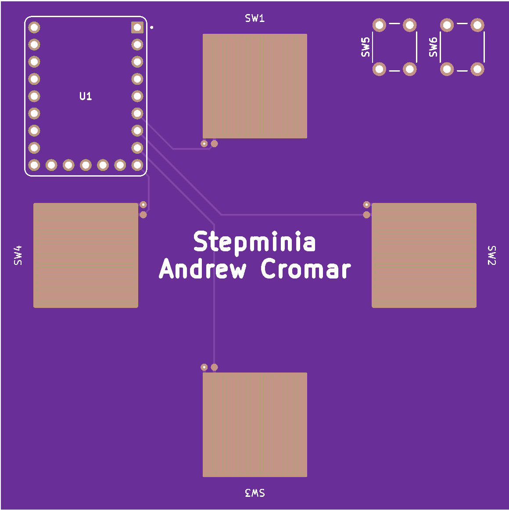

# PCB

The pcb (or circuit board) will be the main part that is needed for the device to work.

This section will guide you through downloading the files to having them manufactured.

## Download

[Click here to download the production files.](https://github.com/AndrewCromar/stepminia/raw/main/pcb/simple/production.zip)

## Manufacturing via JLC

1. [Open JLCPCB.](https://jlcpcb.com/)
2. Sign in or create an account.
3. Click the `Order Now` button.
4. Click the `Add gerber file` button and select the `production.zip` file you just downloaded.
5. You can leave all the settings default.
6. Click the `Save To Cart` button.
7. Go to your cart and checkout via the `Secure Checkout` button.

Your pcb has been ordered!

## Example

{ width="250" }

!!! note
    Your pcb will likly be green but you can choose the color at step 5.